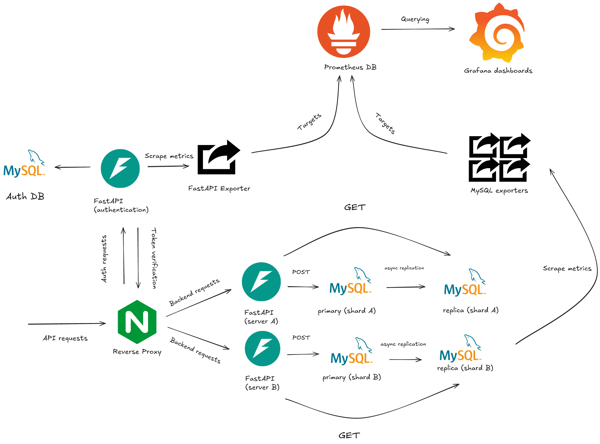
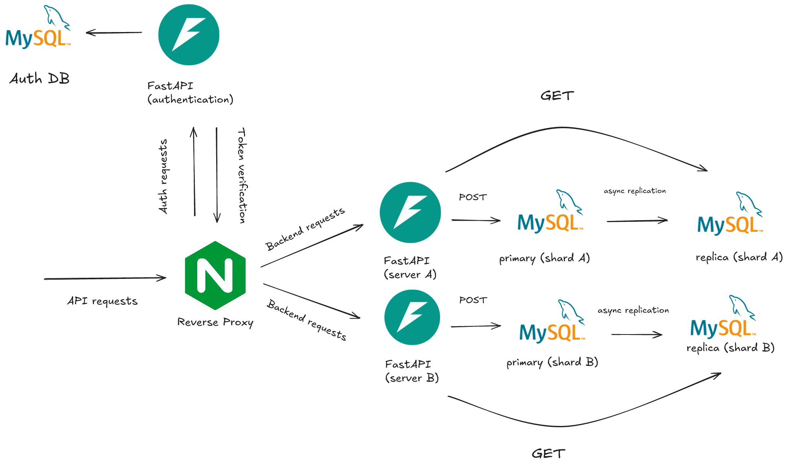
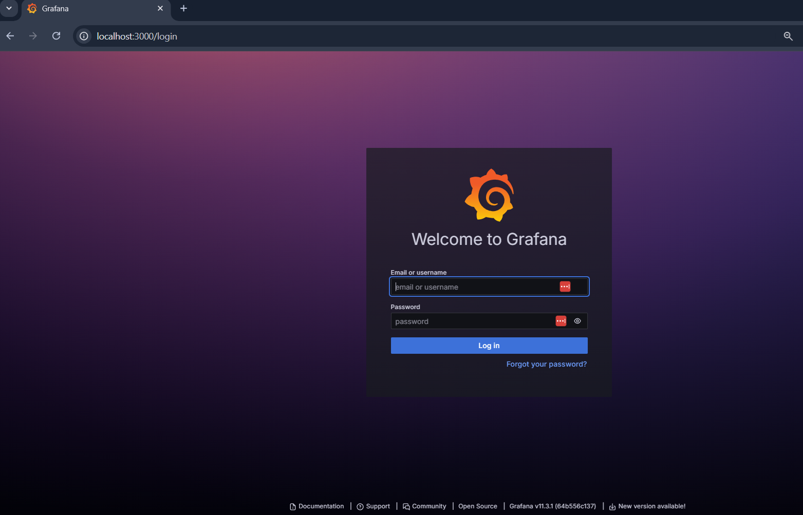
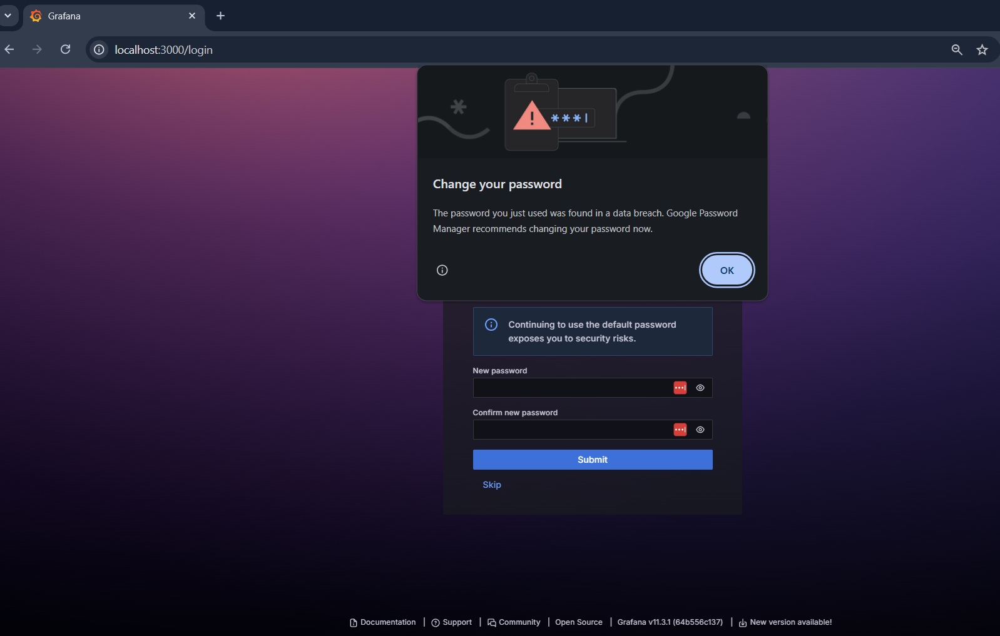
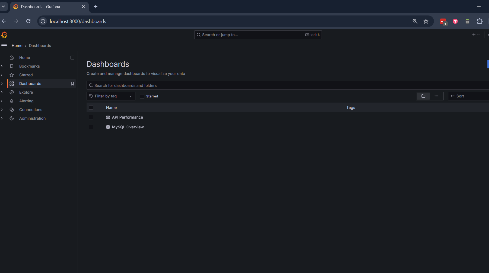
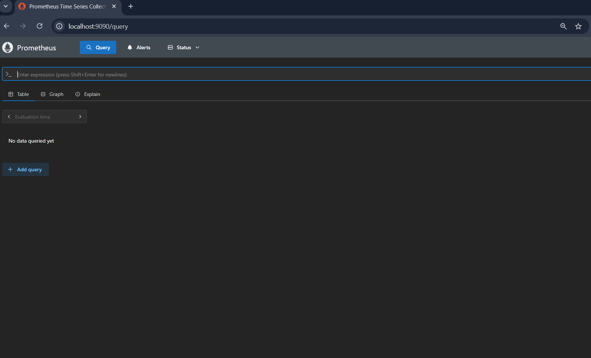
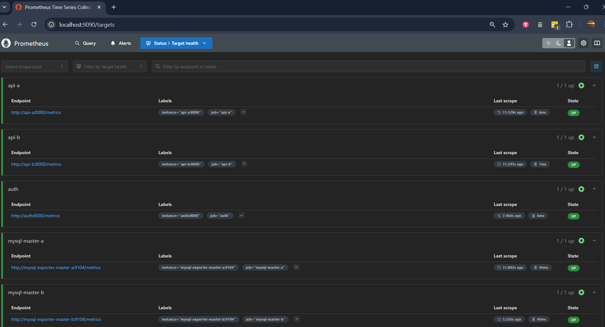

# Adding monitoring with Prometheus and Grafana : Part 1

# Introduction
This is a continuation of the work I did in the [previous article](https://open.substack.com/pub/invariantsubspace/p/exploring-reverse-proxies-and-authentication?r=4l2b0p&utm_campaign=post&utm_medium=web). As usual, I recommend reading the previous article to understand the context, however it is not required to follow this article. In the previous article, I set up a reverse proxy and added authentication to the project.In this article, I will be adding monitoring with Prometheus and Grafana to the project. Due to the complexity of the project, I will be splitting this into multiple parts. 

In line with our goal of building a robust, scalable system, this post will focus on implementing comprehensive monitoring using Prometheus and Grafana. As our distributed system grows in complexity, with multiple services, shards, and databases, effective monitoring becomes crucial for maintaining reliability and performance.

A well-designed monitoring system provides:
1. Real-time visibility into service health and performance
2. Database metrics across multiple shards and replicas
3. API performance tracking and request patterns
4. Early warning signs of potential issues

We'll explore how to integrate Prometheus for metrics collection and Grafana for visualization, creating a monitoring solution that helps maintain and scale our distributed architecture effectively.

In this post I will cover the following topics:

1. Prometheus : We'll explore how to configure Prometheus for metrics collection. Prometheus is a time series database that is used to store the metrics collected from the exporters.

2. Grafana : We'll explore how to configure Grafana for visualization. Grafana is a tool that is used to visualize the metrics collected by Prometheus.

3. Running the project : We'll explore how to run the project and how to use the monitoring.


As usual I'll take the existing project and add changes to it. I won't cover all of the changes in detail, but I'll provide enough information to understand the changes and how they work. You can find the previous article [here](https://open.substack.com/pub/invariantsubspace/p/exploring-reverse-proxies-and-authentication?r=4l2b0p&utm_campaign=post&utm_medium=web) along with the code for the project [here](https://github.com/Shogun89/reverse_proxy_and_jwt_auth). The repo for the new project will be [here](https://github.com/Shogun89/prometheus_and_grafana). Feel free to clone the repo and follow along. As mentioned before there is a docs folder in the repo that contains the documentation for the project. Feel free to read it to understand the changes and how they work. In addition it has a markdown file with the prior work and the future work I intend to do.  


# Architecture

As usual I'll be reviewing the architecture of the project and the previous project to understand the changes and how they work. I had initially planned for this to be a single part article, but due to the complexity of the project and the amount of changes I'm making, I've decided to split it into multiple parts. As mentioned before, I'll be adding monitoring to the project with Prometheus and Grafana. As an aside I made these diagrams using [Excalidraw](https://excalidraw.com/). I really like the tool and it's free. 

Below is a diagram of the project architecture.



And below is a diagram of the previous project architecture.



As you can see the architecture is fundamentally the same except for the addition of the monitoring components. In order for the monitoring to work we need to add the following components:

1. Prometheus : This will be used to collect metrics from the system.

2. Grafana : This will be used to visualize the metrics collected by Prometheus.

3. MySQL Exporter : This will be used to collect metrics from the MySQL databases.

4. FastAPI Exporter : This will be used to collect metrics from the FastAPI application.

The way this works is that Prometheus will scrape the metrics from the various exporters and then store them in a time series database. Grafana will then query the Prometheus database and visualize the metrics. In the case of the FastAPI application we don't actually need a separate Docker container for the exporter. We can just use the FastAPI application itself to collect the metrics. To do this we simply import the `Instrumentator` class from the `prometheus_fastapi_instrumentator` package and add it to the FastAPI application. Currently I've only added it to the backend service, but I plan on adding it to the auth service as well. 

While it may not be necessary to have separate Docker containers for the MySQL exporters I've decided to do it this way. To do this they need a configuration file (.conf) that contains the connection information for the MySQL database. I've added these files to the compose files for the backend services. After the exporters are running they will be able to collect the metrics from the MySQL databases and store them in the Prometheus database. These need to be setup in another configuration file as targets in the Prometheus configuration file. After that is done we can start the Prometheus container and it will begin scraping the metrics from the exporters. Finally the Grafana container needs to be configured use the Prometheus database as a data source and we need to define the dashboards and the metrics in the Grafana dashboards. 

# Project Structure
This is a brief overview of the changes I've made to the project structure. There is now a monitoring folder in the project root. This contains the Prometheus and Grafana configuration files and the dashboards. 

```
project_root/
├── backend/ (FastAPI e-commerce code/Docker code/shell scripts)
├── auth/ (FastAPI authentication code/Docker code/shell scripts)
├── images/ (images used in readme)
├── monitoring/ (Prometheus and Grafana configuration files and dashboards)
├── router/ (nginx config/Docker code)
├── tests/ (Python testing code/Docker code)
└── docs/ (readmes)
```

To be more specific the monitoring folder contains the following files:

```
monitoring/
├── prometheus/ (Prometheus configuration files)
├── grafana/
    ├── dashboards/ (Grafana dashboard JSON files)
    └── provisioning/
        ├── dashboards/ (Dashboard provisioning configs)
        └── datasources/ (Datasource provisioning configs)
```

In addition there is a Docker compose file for the monitoring services. This is located in the root of the project and is named `compose.monitoring.yml`. This file will start the Prometheus and Grafana containers and the exporters. 

# Setting up Prometheus

This section will cover the changes necessary to setup Prometheus. It is made of three parts. The first part is about the configuration of the exporters, the second part is about the configuration of the Prometheus server and the third part is to add the Prometheus server to the compose files. The exporter configuration is fairly straightforward. In the case of the FastAPI application we don't need a separate Docker container for the exporter. We can just use the FastAPI application itself to collect the metrics. To do this we simply import the `Instrumentator` class from the `prometheus_fastapi_instrumentator` package and add it to the FastAPI application. This looks like this:

```python
from prometheus_fastapi_instrumentator import Instrumentator

app = FastAPI()

Instrumentator().instrument(app).expose(app)
```
The second step of the exporter configuration is to add containers for each of the MySQL databases in the backend services. Doing this is a bit more complex. It involves a few steps

1. Update the backend compose file to include the MySQL exporters.
2. Add .conf files to the MySQL exporters.
3. Add a Docker file for the MySQL exporters.
4. Update the main compose to extend the backend compose file and use the MySQL exporters.

For the first step each of the backend container configurations looks like this:

```yaml
mysql-exporter-master-a:
build:
    context: .
    dockerfile: Dockerfile.mysql-exporter
container_name: mysql-exporter-master-a
command:
    - --config.my-cnf=/etc/mysql/my-master-a.cnf
ports:
    - "9104:9104"
depends_on:
    - mysql-master-a
networks:
    - monitoring-network

```

It creates an exporter container that is dependent on the MySQL container and is on the monitoring network. The exporter container is configured to use the .conf file for the MySQL database and to expose the metrics on port 9104. Port 9104 is the default port for the MySQL exporter.  The .conf file is located in the backend folder under a config folder. There is a similar configuration file for each container and they all look alike except for the hostname. These simply have the connection information for the MySQL database. These look like: 


```
[client]
user=root
password=rootpassword
host=mysql-master-a
port=3306 
```
For the next step we need to add a Dockerfile for the MySQL exporters. This looks like this:

```dockerfile
FROM prom/mysqld-exporter

USER root
COPY config/my-*.cnf /etc/mysql/
RUN chmod 644 /etc/mysql/my-*.cnf && \
    chown -R nobody:nobody /etc/mysql/

USER nobody

ENTRYPOINT [ "/bin/mysqld_exporter" ]
```

This is very straightforward. It simply copies the .conf files to the container and sets the permissions. The last step is to update the main compose file to extend the backend compose file and use the MySQL exporters. This looks like this:

```yaml
# MySQL Exporters for Shard 1
mysql-exporter-master-a:
extends:
    file: backend/compose.backend.yml
    service: mysql-exporter-master-a
networks:
    - monitoring-network

```

Now the second step is to update the Prometheus configuration file to include the MySQL exporters as targets. This looks like this:

```yaml
global:
  scrape_interval: 15s
  evaluation_interval: 15s

scrape_configs:
  - job_name: 'mysql-master-a'
    static_configs:
      - targets: ['mysql-exporter-master-a:9104']
```
In the actual configuration file there are multiple targets for each of the MySQL exporters. This is because there are multiple MySQL databases in each shard. This configuration file is located in the prometheus folder under the name `prometheus.yml` and it defines the targets for each of the exporters as well as the global configuration for the Prometheus server. The global configuration is used to set the scrape interval and the evaluation interval. The scrape interval is the interval at which Prometheus will scrape the targets and the evaluation interval is the interval at which Prometheus will evaluate the rules. 

For the third step we need to add the Prometheus server to the compose files. This looks like this:

```yaml
services:
prometheus:
image: prom/prometheus:latest
container_name: prometheus
ports:
    - "9090:9090"
command:
    - --config.file=/etc/prometheus/prometheus.yml
volumes:
    - ./prometheus:/etc/prometheus
networks:
    - monitoring-network

```

This is for the individual monitoring compose file. There is also a main compose file that extends the monitoring compose file and adds the Prometheus server to the other compose files. This looks like this:

```yaml
prometheus:
extends:
    file: monitoring/compose.monitoring.yml
    service: prometheus
networks:
    - monitoring-network

```

# Setting up Grafana
The configuration of Grafana is also fairly straightforward but involves a few steps. These are the steps:

1. Update the Grafana configuration file to include the Prometheus data source.
2. Update the Grafana configuration file to include the dashboards.
3. Define the dashboards in the Grafana configuration file.
4. Add the Grafana server to the compose files.

For the first step we need to update the Grafana configuration file to include the Prometheus data source. This looks like this:

```yaml
apiVersion: 1

datasources:
  - name: Prometheus
    type: prometheus
    access: proxy
    url: http://prometheus:9090
    isDefault: true 
```

This configuration file is located in the grafana folder under the name `datasources.yml`. It defines the data source for the Grafana server. The data source is the Prometheus server and it is configured to use the Prometheus server on port 9090. The isDefault flag is set to true which means that this will be the default data source for the Grafana server. 

For the second step we need to update the Grafana compose file to include the dashboards. This looks like this:

```yaml
apiVersion: 1

providers:
  - name: 'Default'
    orgId: 1
    folder: ''
    type: file
    disableDeletion: false
    editable: true
    options:
      path: /var/lib/grafana/dashboards
      foldersFromFilesStructure: true 

```

For the third step we need to define the dashboards in the Grafana configuration file. These are located in the grafana folder under the dashboards subfolder as `api_metrics.json` and `mysql_overview.json`. These are JSON files that define each dashboard. I won't be going into much detail about how this works however it is also relatively straight forward. These each look like this:

```json
{
  "title": "API Performance",
  "uid": "api_performance",
  "panels": [
    {
      "title": "API Performance Metrics",
      "type": "text",
      "gridPos": {
        "h": 4,
        "w": 24,
        "x": 0,
        "y": 0
      },
      "options": {
        "mode": "markdown",
        "content": "# API Performance Dashboard\nMonitoring key metrics for API performance including request rates and response times"
      }
    },
    {
      "title": "Request Rate",
      "type": "graph",
      "gridPos": {
        "h": 9,
        "w": 12,
        "x": 0,
        "y": 4
      },
      "targets": [
        {
          "expr": "rate(http_requests_total[5m])",
          "legendFormat": "{{instance}}"
        }
      ]
    },
    {
      "title": "Response Times",
      "type": "graph",
      "gridPos": {
        "h": 9,
        "w": 12,
        "x": 12,
        "y": 4
      },
      "targets": [
        {
          "expr": "rate(http_request_duration_seconds_sum[5m]) / rate(http_request_duration_seconds_count[5m])",
          "legendFormat": "{{instance}}"
        }
      ]
    }
  ]
} 

```
The JSON allows you to define the panels and the metrics that are displayed in the dashboard as well as the layout of the dashboard. While you can define the panels in the JSON file you can also directly edit the dashboard in the Grafana UI. 

The final step is to add the Grafana server to the compose files. This looks like this:

```yaml
grafana:
image: grafana/grafana:latest
container_name: grafana
ports:
    - "3000:3000"
environment:
    - GF_SECURITY_ADMIN_USER=admin
    - GF_SECURITY_ADMIN_PASSWORD=admin
volumes:
    - ./grafana/provisioning/datasources:/etc/grafana/provisioning/datasources
    - ./grafana/provisioning/dashboards:/etc/grafana/provisioning/dashboards
    - ./grafana/dashboards:/var/lib/grafana/dashboards
networks:
    - monitoring-network

``` 

This is for the individual monitoring compose file. There is also a main compose file that extends the monitoring compose file and adds the Grafana server to the other compose files. This looks like this:

```yaml
grafana:
extends:
    file: monitoring/compose.monitoring.yml
    service: grafana
networks:
    - monitoring-network

```

# Running the project

Like in prior articles I'll be running all of the services in the main compose file. This is located in the root of the project and is named `docker-compose.yml`. This file will start all of the services in the project. To start the project run the following command:

```bash
docker compose up --build -d
```
This could take a few minutes to build the containers and start running all of the services. Once the services are running you can access the Grafana server at `http://localhost:3000`. The username and password are both `admin`. Once you are logged in you should see the dashboards under the `Dashboards` folder. You can check the logs under the Docker Desktop GUI to ensure that all of the services are running. 

### Logging in to Grafana
You need to log in to Grafana to see the dashboards. The username and password are both `admin`. Once you are logged in you should see the dashboards under the `Dashboards` folder. 



## Skipping changing the password
You should get a warning about changing the password since it is `admin`. You can skip this by clicking the `Skip` button. If this were actually exposed to the public you would want to change the password but this is only running locally. 



### Checking the dashboards
To check the dashboards you can just clicks on the `Dashboards` folder. You should see the dashboards that are defined in the Grafana configuration file. 



### Checking the Prometheus server

You can check the Prometheus server by going to `http://localhost:9090`. You should see the targets that are defined in the Prometheus configuration file. 



### Checking the Prometheus targets

You can check the targets by doing the following:

1. Go to `Status` -> `Monitoring status` -> `Target health`
2. You should see the targets that are defined in the Prometheus configuration file. 



Once you're done you can run the following command to stop and remove all of the services:

```bash
docker compose down
```

# Conclusion & Next Steps
This is the end of the first part of the article. In this part I've covered the setup of Prometheus and Grafana. In the next part I'll be looking at updating the reverse proxy, updating the dashboards, looking into adding alerts and testing the system as a whole. 